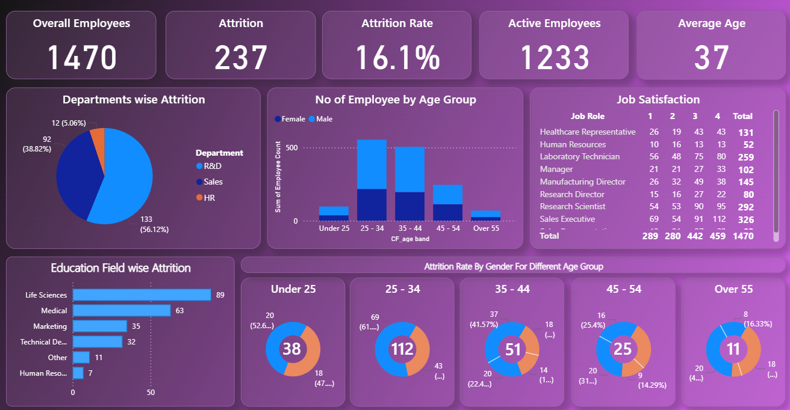

# HR Analytics Dashboard

An end-to-end HR analytics project analyzing employee attrition, department trends, and job satisfaction using SQL, Excel, and Power BI.

---

## 📊 Dashboard Preview

---

## 🎯 Project Objective

To analyze HR data and identify key factors behind employee attrition, helping organizations make data-driven decisions to improve employee retention.

---

## 🔍 Key Insights

- Overall attrition rate is **16.1%** (237 out of 1470 employees)
- **R&D department** has the highest attrition — 56.12%
- **Life Sciences** education field has the most attrition — 89 employees
- Attrition is highest in the **25–34 age group** (112 employees)
- Average employee age is **37**

---

## 🛠️ Tools Used

- **SQL (PostgreSQL)** — data querying and analysis
- **Microsoft Excel** — raw data storage and preprocessing
- **Power BI** — interactive dashboard and visualizations

---

## 📁 Project Files

| File | Description |
|------|-------------|
| `hrdata.csv` | Raw HR dataset |
| `hrdatabase.sql` | Database schema and data |
| `hr_database_queries.sql` | All analytical SQL queries |
| `hr_dashboard.pbix` | Power BI dashboard file |
| `hrdashboard.png` | Dashboard screenshot |
| `queries.docx` | Query documentation |

---

## 📌 SQL Analyses Covered

- Employee count & attrition rate
- Active employees
- Attrition by gender, department, age group, education field
- Job satisfaction by job role
- Attrition rate by gender for different age groups

---

## 👤 Author

**yuarzumanyan-coder**  
Aspiring Data Analyst
